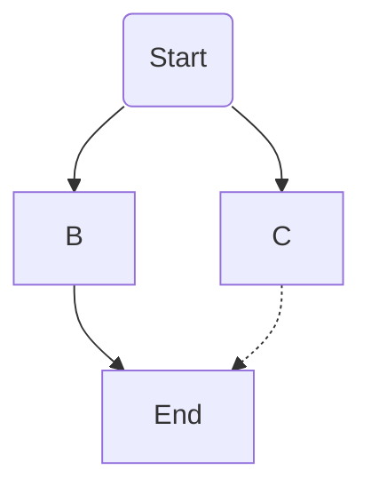

## My Notes on AI

---
### Topics:
1. [Models](#models)
1. [LLM Interfaces](#llm-interfaces)
2. [AI coding workflows](#ai-coding-workflows)
3. [Everything else](#everything-else)

---
#### Models
##### Anthropic Claude
Claude 3.5 Sonnet from Anthropic delivers better-than-Opus capabilities, faster-than-Sonnet speeds, at the same Sonnet prices. Sonnet is particularly good at:

- Coding: Autonomously writes, edits, and runs code with reasoning and troubleshooting
- Data science: Augments human data science expertise; navigates unstructured data while using multiple tools for insights
- Visual processing: excelling at interpreting charts, graphs, and images, accurately transcribing text to derive insights beyond just the text alone
- Agentic tasks: exceptional tool use, making it great at agentic tasks (i.e. complex, multi-step problem solving tasks that require engaging with other systems)

##### Google Gemini
Google's latest multimodal model, supporting image and video in text or chat prompts.

Optimized for language tasks including:

- Code generation
- Text generation
- Text editing
- Problem solving
- Recommendations
- Information extraction
- Data extraction or generation
- AI agents

##### OpenAI
OpenAI o1 is the latest and strongest model family from OpenAI, o1 is designed to spend more time thinking before responding.

The o1 models are optimized for math, science, programming, and other STEM-related tasks. They consistently exhibit PhD-level accuracy on benchmarks in physics, chemistry, and biology.

##### Key differences:

1. OpenAI o1 shows superior performance in complex reasoning and coding tasks [1](https://blog.getbind.co/2024/09/17/gpt-o1-vs-claude-3-5-sonnet-which-model-is-better-for-coding/) [3](https://university.tenten.co/t/top-llm-apis-compared-openai-llama-gemini-sonar-claude-september-2024/1424).
2. Claude 3.5 Sonnet excels in graduate-level reasoning and has strong multimodal capabilities [3](https://university.tenten.co/t/top-llm-apis-compared-openai-llama-gemini-sonar-claude-september-2024/1424) [4](https://www.signitysolutions.com/tech-insights/claude3.5-vs-chatgpt4o-vs-gemini1.5pro).
3. Gemini 1.5 offers the largest context window, up to 2 million tokens, and strong multimodal processing [2](https://www.databricks.com/blog/long-context-rag-capabilities-openai-o1-and-google-gemini) [5](https://blog.getbind.co/2024/10/09/gemini-1-5-pro-vs-claude-3-5-sonnet-which-is-best-for-coding/).
4. o1 has shown significant improvements over previous models in reasoning and safety benchmarks [1](https://blog.getbind.co/2024/09/17/gpt-o1-vs-claude-3-5-sonnet-which-model-is-better-for-coding/).
5. Claude 3.5 Sonnet has advanced multilingual capabilities and high-quality content generation [3](https://university.tenten.co/t/top-llm-apis-compared-openai-llama-gemini-sonar-claude-september-2024/1424).
6. Gemini 1.5 maintains consistent performance across extremely long contexts [2](https://www.databricks.com/blog/long-context-rag-capabilities-openai-o1-and-google-gemini).

---
#### LLM Interfaces

##### Msty

##### LibreChat

##### OpenWebUI

---

#### AI code editing

##### Pear AI

##### Continue.dev

##### Phind 

---

#### Everything Else

##### Model Providers

###### OpenRouter

###### Groq

https://aider.chat/

Aider lets you pair program with LLMs, to edit code in your local git repository. Start a new project or work with an existing git repo. Aider works best with GPT-4o & Claude 3.5 Sonnet and can [connect to almost any LLM](https://aider.chat/docs/llms.html).
###### AbacusAI

---

#### Bringing it all together into one workflow

